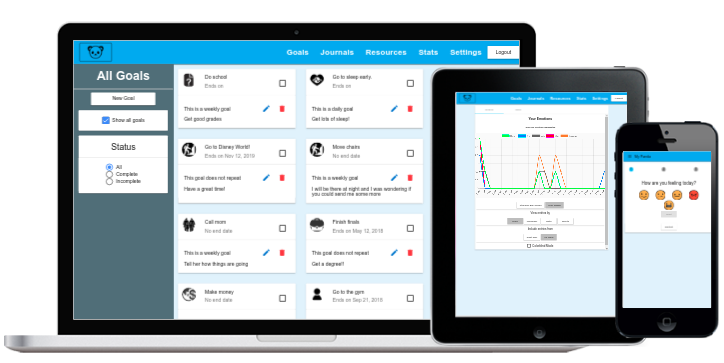

## Table of Contents
- [What is My Panda](#what-is-my-panda)
- [Getting Started](#getting-started)
- [Homepage](#homepage)
- [Goals](#goals)
	- [Adding a goal](#adding-a-goal)
	- [Using your goal](#using-your-goal)
- [Journals](#journals)
	- [Adding a journal](#adding-a-journal)
	- [Editing and deleting a journal](#editing-and-deleting-a-journal)
- [Resources](#resources)
	- [Adding and deleting a YouTube video](#adding-and-deleting-a-youtube-video)
	- [Adding and deleting a contact](#adding-and-deleting-a-contact)
- [Stats](#stats)
	- [Graphs](#graphs)
	- [Tables](#tables)
- [Settings](#settings)
- [Authors](#authors)

	

## What is My Panda

[My Panda](https://mypanda.website) is a web app that promotes mental health. This is achieved through providing the capability to record emotions, set goals, and write journals. These allow for quick and convenient ways to reflect on past trends and promote personal growth. Furthermore, My Panda provides resources for managing stress, anxiety, anger, and much more!

## Getting Started

To start, you'll need a Google account to log-in. You can find the **sign in** button in the top right on a desktop view, or in the side menu on a mobile view. Once you're signed in, you'll have access to the rest of the site.

## Homepage

The home page houses the main feature of the web app’s emotion recording. You have the choice of five different emotions (happy, sad, meh, angry, anxious). After selecting your current emotion and clicking the **next** button, there may be the option to select your emotional intensity on a scale of 1-5. This option will only occur if you haven't selected "Meh" as your emotion. After clicking the **next** button again, you will be given the option to describe why you feel the way you do, with the prompt "I'm feeling this way because..." However, this portion is optional. The final step is clicking the **submit** button, which will log your emotion and send you to a YouTube video playlist that provides useful resources for each emotion.

At any point in this process, if you want to start over, you can click the **restart** button  to remove your progress and return to the first step.

## Goals

The goals page has two distinct views depending on whether the user is on desktop or a mobile device. 

The desktop view contains a sidebar with a **new goal** button and a checkbox toggle to switch between showing today's goals and all goals. If **show all goals** is selected, three options to filter the goals appear: all, complete, and incomplete. The right side of the screen is reserved for goals, which are viewed as material cards.

The mobile view contains a navbar, a toggle to show all goals, and filtering options if **show all goals** is checked at the top of the screen. In the bottom right corner there is a button to add a new goal which is indicated by a plus icon. The center of the screen is reserved for listing goals.

### Adding a goal

To create a goal, click the aforementioned **new goal** button. When creating a goal, it requires the text of the goal, a category, and a frequency. Optionally, you can include text that describes the purpose of the goal and an end date. 

### Using your goal

A goal begins as incomplete and can be marked as complete by clicking on the check box located to the right of the title. A complete goal stays complete once marked if a frequency of *does not repeat* is selected. If a different frequency is selected, the goal will automatically mark itself as incomplete once the specified time period has passed. This behavior will end if an end date was specified once the end date has been reached.

A goal can be deleted by clicking the trash icon on desktop. On a mobile device, the goal must be selected by clicking on it to open its own page, then deleted by clicking on the trash icon in the top right corner.

A goal can be edited by clicking on the pen icon on desktop. On a mobile device, the goal must be selected by clicking on it to open its own page, then edited by clicking on the pen icon in the bottom right corner.

## Journals

The journals page has two distinct views depending on whether one is on desktop or a mobile device. 

The desktop view contains a sidebar with a **new journal** button, a search bar which searches through the title and content of all journals, and a **journal prompt** button. If **journal prompt** is clicked, a journal prompt will be displayed that allows a user to write a journal. The right side of the screen is reserved for journals which are viewed as material cards.

The mobile view contains a navbar, a search bar, and a **prompts** button. When the **prompts** button is clicked, a pop-up will appear with a prompt that a journal can be written for. In the bottom right corner, there is a button to add a new journal which is indicated by a plus sign. The center of the screen is reserved for listing journals.

### Adding a journal

To add a new journal on desktop click the **new journal** button located on the sidebar. On mobile, tap the **+** button in the bottom right corner. This presents a dialog box requiring a title for the journal and the content of the journal. You can get a journal prompt by clicking the **journal prompt** button on the desktop sidebar, or tapping the blue **prompts** button on the top right of a mobile device.

### Editing and deleting a journal

Clicking or tapping on a journal card will bring you to a page displaying the entirety of the selected journal. Pressing the blue pencil button will allow you to edit the journal. On desktop, it is located on the right-hand side of the title portion of the journal card. On mobile, it is located in the bottom right corner of the screen. To delete a journal, press the trash icon. On desktop, it is red, and is located on the right-hand side of the title portion of the journal card, next to the edit button. On mobile, the trash icon is grey, and is located in the top right corner of the screen. To go back to the journals page, either click the **Back** button on the desktop sidebar, or tap the arrow located in the top left corner on mobile.

## Resources
The resources page is here to make sure that in times of need you always have the necessary contacts and web resources within you reach through My Panda. You can add your own list of people you like to reach out to when you’re feeling a little anxious or that favorite cat video in youtube that always puts a smile in your face into the resources page and they will always be there in your times of need.

### Adding and deleting a YouTube video
You can add the title of your video in the YouTube Title with its corresponding video URL and it will be added to the list of videos you previously added. Press the little play icon next to the name of the video and it will open the video in new window. Don’t like that video anymore? Press the trash icon next to it and it will get taken care of. 

### Adding and deleting a contact
You can add that favorite person you always like to talk to in times of anxiety and maybe even when you’re happy using this feature. Add the name of the person with their phone number and click submit to add them to the list. Press the little trash icon text to it if you don’t want that number to show there anymore and that will be taken care of as well. 

 

## Stats
The stats page contains a ‘graph view’ and a ‘table view’, which can be traversed by clicking on the **Graphs** tab or **Table** tab.

### Graphs
The total number of emotions logged can be seen at the top of the page.

Emotion(s) can be excluded from the graph by clicking on said emotion(s)’s legend/toggle.

There are two different graph views, ‘Stacked Bar Graph’ and ‘Line Graph’. Clicking on the **Stacked Bar Graph** button changes the graph to a stacked bar graph. Clicking on the **Line Graph** button changes the graph to a line graph. Users can view entries by **hour**, **weekday**, **date**, or **month** simply by clicking on the preferred view. Users also have the option to include all entries by clicking on the **All Time** button or view only past month entries by clicking on the **Past Month** button. Users can enable Colorblind Mode by clicking on the **Colorblind** toggle.

### Table
The table can be filtered by **Emotion**, **Intensity**, or **Date**.  The **Clear Date Filters** buttons removed dates from filtering. The **total emotions logged can be viewed under 

## Settings
The settings page houses the different fonts and themes. To change the font on the web-app, **click** on the font of your choice. To change the theme of the web-app, **click** on the color pallette of your choice.

# Authors

To see more detailed information on each team member’s individual commits and contributions, see the GitHub [contributors page](https://github.com/UMM-CSci-3601-S18/iteration-4-megabittron/graphs/contributors)

### Team Members
- Abenezer Monjor
- Ahnaf Prio
- Charles Menne
- Dustin Blake 
- Francisco Montanez
- John Hoff
- Travis Warling
- Xaitheng Yang

[angular-karma-jasmine]: https://codecraft.tv/courses/angular/unit-testing/jasmine-and-karma/
[e2e-testing]: https://coryrylan.com/blog/introduction-to-e2e-testing-with-the-angular-cli-and-protractor
[environments]: http://tattoocoder.com/angular-cli-using-the-environment-option/
[spark-documentation]: http://sparkjava.com/documentation.html
[status-codes]: https://en.wikipedia.org/wiki/List_of_HTTP_status_codes
[lab2]: https://github.com/UMM-CSci-3601/3601-lab2_client-server/blob/master/README.md#resources
[mongo-jdbc]: https://docs.mongodb.com/ecosystem/drivers/java/
[labtasks]: LABTASKS.md
[travis]: https://travis-ci.org/

